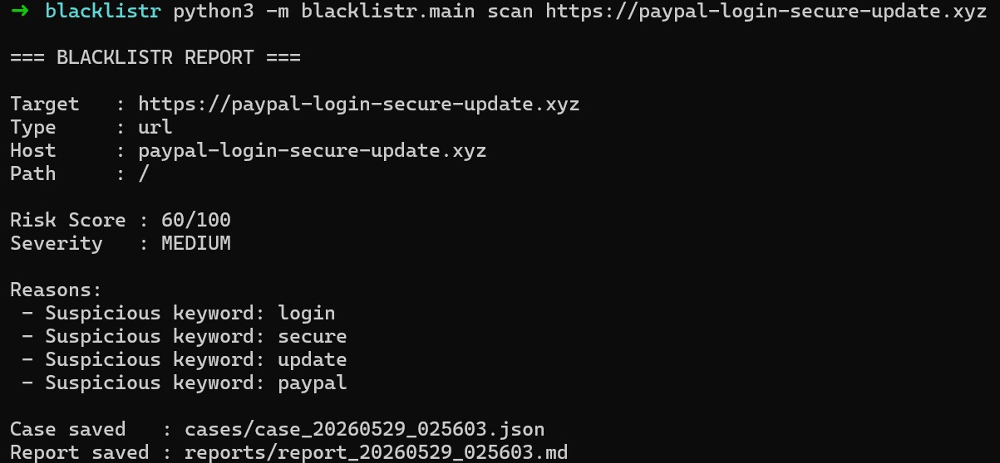
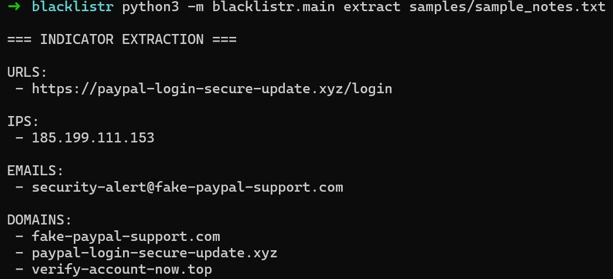

# Blacklistr

A lightweight CLI-based threat triage toolkit for analyzing suspicious URLs, domains, IP addresses, and investigation notes.

Blacklistr is a cybersecurity learning project focused on simulating basic analyst workflows. It performs risk analysis, extracts indicators of compromise (IOCs), stores investigation cases locally, and generates reports for later review.

---

## Features

* URL, domain, and IP classification
* Suspicious keyword detection
* Risk scoring engine
* IOC extraction from notes and logs
* JSON case storage
* Markdown report generation
* Fully offline operation
* Simple command-line interface

---

## Screenshots

### URL Analysis



### IOC Extraction



---

## Example Usage

### Analyze a Suspicious URL

```bash
python3 -m blacklistr.main scan https://paypal-login-secure-update.xyz
```

### Extract Indicators from Notes

```bash
python3 -m blacklistr.main extract samples/sample_notes.txt
```

---

## Example Output

```text
=== BLACKLISTR REPORT ===

Target   : https://paypal-login-secure-update.xyz
Type     : url
Host     : paypal-login-secure-update.xyz

Risk Score : 60/100
Severity   : MEDIUM

Reasons:
 - Suspicious keyword: login
 - Suspicious keyword: secure
 - Suspicious keyword: update
 - Suspicious keyword: paypal
```

---

## Workflow

```text
Input
  ↓
Classification
  ↓
Risk Analysis
  ↓
IOC Extraction
  ↓
Case Storage
  ↓
Report Generation
```

---

## Project Structure

```text
blacklistr/
├── blacklistr/
│   ├── main.py
│   ├── scanner.py
│   ├── scoring.py
│   ├── indicators.py
│   ├── storage.py
│   └── reporter.py
├── cases/
├── reports/
├── samples/
├── screenshots/
└── README.md
```

---

## Why I Built It

While learning cybersecurity, I wanted a simple tool that could help me triage suspicious indicators without jumping between multiple websites and tools.

Blacklistr combines several common investigation tasks into a single workflow and helped me better understand threat triage, IOC extraction, and analyst-style reporting. The goal was not to replace professional security tools, but to build something practical that I could improve and explain in interviews.

---

## Future Improvements

* WHOIS enrichment
* Passive DNS lookups
* Threat intelligence feed integration
* VirusTotal integration
* Improved domain analysis
* Case history command
* Log ingestion support
* Additional report formats

---

## Author

**Siddharth S Menon**

* GitHub: https://github.com/siddharthmnn
* LinkedIn: https://www.linkedin.com/in/siddharthmnn

---

## License

MIT License
